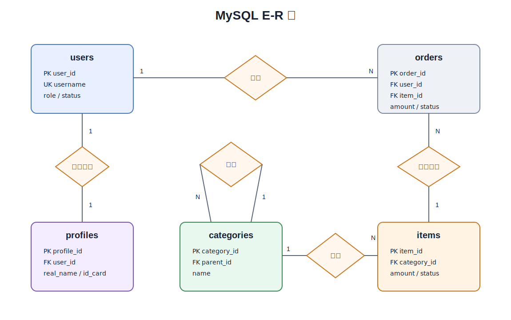

# MySQL 数据库设计

<!-- markdownlint-disable MD013 -->

## 设计目标

MySQL 保存用户、分类、血液库存批次、用血申请和实名档案等结构化数据，负责关系约束、事务一致性和核心报表。

设计目标覆盖课程要求和献血管理系统的核心业务：

- 支持用户注册、登录和角色管理。
- 支持献血者、血液库存、用血申请的基础管理。
- 支持核心业务数据查询、记录创建和统计报表。
- 支持主外键约束、索引、视图、存储过程、触发器和 JDBC 事务。

## MySQL E-R 图

## 业务映射

课程要求中的表名较通用，项目中按以下方式映射到献血管理业务。

| 表名 | 课程要求 | 项目含义 |
| --- | --- | --- |
| users | 用户表 | 系统登录用户，包括管理员和普通用户 |
| categories | 分类表 | 血液类型、血液成分、业务类型等树形分类 |
| items | 核心业务表 | 血液库存批次 |
| orders | 订单/记录表 | 用血申请和用血记录 |
| profiles | 用户档案表 | 用户或献血者的实名档案信息 |

## 表设计

### users 用户表

保存系统登录用户和角色。

| 字段 | 类型 | 约束 | 说明 |
| --- | --- | --- | --- |
| user_id | BIGINT | PK, AUTO_INCREMENT | 用户 ID |
| username | VARCHAR(50) | NOT NULL, UNIQUE | 登录名 |
| password_hash | VARCHAR(255) | NOT NULL | 密码哈希 |
| email | VARCHAR(100) | UNIQUE | 邮箱 |
| phone | VARCHAR(20) | | 手机号 |
| role | ENUM('ADMIN','USER') | NOT NULL | 角色 |
| status | TINYINT | NOT NULL, DEFAULT 1 | 状态，1 启用，0 禁用 |
| created_at | DATETIME | NOT NULL | 创建时间 |
| updated_at | DATETIME | NOT NULL | 更新时间 |

索引：

- `uk_users_username`：`username`
- `uk_users_email`：`email`
- `idx_users_phone`：`phone`

### categories 分类表

保存业务分类，支持父子级结构。

| 字段 | 类型 | 约束 | 说明 |
| --- | --- | --- | --- |
| category_id | BIGINT | PK, AUTO_INCREMENT | 分类 ID |
| name | VARCHAR(50) | NOT NULL | 分类名称 |
| parent_id | BIGINT | FK | 父分类 ID |

约束：

- `fk_categories_parent_id`：`parent_id` 关联 `categories.category_id`

索引：

- `idx_categories_parent_id`：`parent_id`
- `uk_categories_parent_name`：`parent_id`, `name`

分类示例：

- 血液类型：A 型、B 型、AB 型、O 型。
- 血液成分：全血、红细胞、血浆、血小板。
- 业务类型：库存入库、用血申请、库存出库。

### items 核心业务表

保存血液库存批次。固定字段保存通用信息，扩展详情保存到 MongoDB 的 `item_details` 集合。

| 字段 | 类型 | 约束 | 说明 |
| --- | --- | --- | --- |
| item_id | BIGINT | PK, AUTO_INCREMENT | 库存批次 ID |
| title | VARCHAR(200) | NOT NULL | 库存批次标题 |
| category_id | BIGINT | NOT NULL, FK | 分类 ID |
| amount | DECIMAL(10,2) | NOT NULL | 当前可用量，单位 ml |
| status | TINYINT | NOT NULL, DEFAULT 1 | 状态，1 可用，0 不可用 |
| created_at | DATETIME | NOT NULL | 创建时间 |
| updated_at | DATETIME | NOT NULL | 更新时间 |

约束：

- `fk_items_category_id`：`category_id` 关联 `categories.category_id`

索引：

- `idx_items_category_id`：`category_id`
- `idx_items_status`：`status`
- `idx_items_created_at`：`created_at`

### orders 订单/记录表

保存用血申请和用血记录。每条记录关联一个血液库存批次。

| 字段 | 类型 | 约束 | 说明 |
| --- | --- | --- | --- |
| order_id | BIGINT | PK, AUTO_INCREMENT | 记录 ID |
| user_id | BIGINT | NOT NULL, FK | 操作用户 ID |
| item_id | BIGINT | NOT NULL, FK | 库存批次 ID |
| amount | DECIMAL(10,2) | NOT NULL | 用血量，单位 ml |
| status | TINYINT | NOT NULL, DEFAULT 0 | 状态，0 待审批，1 已完成，2 已取消 |
| created_at | DATETIME | NOT NULL | 创建时间 |

约束：

- `fk_orders_user_id`：`user_id` 关联 `users.user_id`
- `fk_orders_item_id`：`item_id` 关联 `items.item_id`

索引：

- `idx_orders_user_id`：`user_id`
- `idx_orders_item_id`：`item_id`
- `idx_orders_status`：`status`
- `idx_orders_created_at`：`created_at`

### profiles 用户档案表

保存用户或献血者的实名档案信息。

| 字段 | 类型 | 约束 | 说明 |
| --- | --- | --- | --- |
| profile_id | BIGINT | PK, AUTO_INCREMENT | 档案 ID |
| user_id | BIGINT | NOT NULL, FK | 用户 ID |
| real_name | VARCHAR(50) | NOT NULL | 真实姓名 |
| id_card | VARCHAR(20) | NOT NULL | 证件号 |
| address | VARCHAR(500) | | 地址 |
| notes | TEXT | | 备注 |

约束：

- `fk_profiles_user_id`：`user_id` 关联 `users.user_id`

索引：

- `uk_profiles_user_id`：`user_id`
- `uk_profiles_id_card`：`id_card`

## 视图设计

### v_user_profile

用于查询用户及实名档案信息。

主要字段：

- `user_id`
- `username`
- `email`
- `phone`
- `role`
- `status`
- `real_name`
- `id_card`
- `address`

### v_item_summary

用于查询血液库存批次和用血记录汇总。

主要字段：

- `item_id`
- `title`
- `category_name`
- `available_amount`
- `item_status`
- `order_count`
- `used_amount`
- `last_order_at`

### v_pending_orders

用于查询待审批的用血申请。

主要字段：

- `order_id`
- `username`
- `item_id`
- `title`
- `amount`
- `created_at`

### v_monthly_usage_summary

用于月度用血统计。

主要字段：

- `year_month`
- `category_name`
- `order_count`
- `used_amount`
- `completed_count`
- `cancelled_count`

## 存储过程设计

| 存储过程 | 用途 | 输入 |
| --- | --- | --- |
| sp_monthly_report | 生成月度用血统计 | 年份、月份 |
| sp_category_report | 按分类统计库存可用量和批次数 | 分类 ID |
| sp_user_order_report | 查询用户用血申请统计 | 用户 ID、开始时间、结束时间 |

## 触发器设计

| 触发器 | 触发时机 | 用途 |
| --- | --- | --- |
| trg_items_before_insert | 新增库存批次前 | 校验 `amount` 不能小于等于 0 |
| trg_items_before_update | 更新库存批次前 | 校验 `amount` 不能小于 0，并自动维护 `updated_at` |
| trg_orders_before_insert | 新增用血申请前 | 校验 `amount` 不能小于等于 0 |
| trg_orders_before_update | 更新用血申请前 | 校验状态流转；状态改为已完成时校验库存批次可用量足够 |

## 事务设计

写入流程统一使用 Java/JDBC 事务。MySQL 存储过程只用于报表和统计，触发器只作为兜底校验。

| 流程 | Java/JDBC 事务内容 |
| --- | --- |
| 登记血液库存 | 写入 `items` |
| 创建用血申请 | 检查用户状态、检查库存批次状态、检查当前可用量、写入 `orders` |
| 审批用血申请 | 检查申请状态、检查当前可用量、更新 `orders.status`、扣减 `items.amount`、必要时更新 `items.status` |
| 取消用血申请 | 检查申请状态、更新 `orders.status` |

## Mock 数据要求

Mock 数据用于开发调试、功能演示和课程验收，不在设计文档中列出具体数据内容。

| 数据范围 | 要求 |
| --- | --- |
| 基础数据 | 每张表至少 10 条记录，覆盖启用、禁用、待审批、已完成、已取消等主要状态 |
| 关联数据 | 外键关系必须完整，保证用户、档案、分类、库存批次和用血记录能够联查 |
| 报表覆盖 | Mock 数据必须能支撑视图和存储过程查询出有效结果 |
| 数据安全 | Mock 数据不得使用真实身份证号、真实手机号、真实住址或真实患者信息 |
