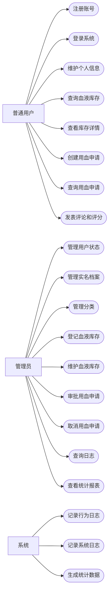

# 献血管理系统需求规格说明书

## 1. 项目概述

献血管理系统用于支持血站对献血者、血液库存、用血申请、操作日志和统计报表
进行统一管理。系统通过 MySQL 保存用户、分类、库存批次、用血申请和实名档案
等结构化数据，通过 MongoDB 保存行为日志、评论、库存详情和系统日志
等扩展数据。

系统面向课程实训和项目答辩场景，重点覆盖数据库设计、JDBC 访问、事务处理、MongoDB 聚合统计、日志记录和基础权限控制。

## 2. 建设目标

- 支持用户注册、登录、信息维护和角色管理。
- 支持血液库存批次的登记、查询、维护和详情管理。
- 支持用血申请创建、审批、取消和查询。
- 支持行为日志、系统日志、评论和评分记录。
- 支持库存、用血、用户行为和系统审计等统计报表。
- 支持 MySQL 与 MongoDB 混合数据存储。
- 满足课程验收所需的功能、文档、测试和答辩要求。

## 3. 用户角色

| 角色 | 说明 | 主要权限 |
| --- | --- | --- |
| 管理员 | 血站管理人员或系统维护人员 | 用户管理、库存管理、用血审批、报表查看、日志审计 |
| 普通用户 | 业务办理人员或普通系统用户 | 注册登录、信息维护、库存查询、用血申请、评论互动 |

## 4. 业务范围

系统覆盖以下业务范围：

- 用户与权限管理。
- 献血者实名档案管理。
- 血液分类和库存批次管理。
- 用血申请和用血记录管理。
- 血液库存详情、图片和扩展属性管理。
- 评论、评分和标签管理。
- 用户行为日志和系统操作日志管理。
- 数据统计、审计和报表查询。

系统不覆盖以下业务范围：

- 医疗诊断、临床治疗方案和病历管理。
- 第三方支付、物流配送和外部医院系统对接。
- 真实短信、邮件和身份核验接口。

## 5. 功能需求

### 5.1 用户管理

| 编号 | 功能 | 说明 | 角色 |
| --- | --- | --- | --- |
| FR-USER-01 | 用户注册 | 用户填写用户名、密码、邮箱、手机号等信息完成注册 | 普通用户 |
| FR-USER-02 | 用户登录 | 用户通过用户名和密码登录系统，登录结果记录到系统日志 | 管理员、普通用户 |
| FR-USER-03 | 信息修改 | 用户维护邮箱、手机号、地址和备注等信息 | 管理员、普通用户 |
| FR-USER-04 | 用户状态管理 | 管理员启用或禁用用户账号 | 管理员 |
| FR-USER-05 | 权限控制 | 系统根据角色控制可访问功能 | 管理员、普通用户 |

### 5.2 档案管理

| 编号 | 功能 | 说明 | 角色 |
| --- | --- | --- | --- |
| FR-PROFILE-01 | 档案创建 | 为用户或献血者创建实名档案 | 管理员 |
| FR-PROFILE-02 | 档案查询 | 按姓名、证件号、用户等条件查询档案 | 管理员 |
| FR-PROFILE-03 | 档案维护 | 修改地址、备注等档案信息 | 管理员 |

### 5.3 分类管理

| 编号 | 功能 | 说明 | 角色 |
| --- | --- | --- | --- |
| FR-CATEGORY-01 | 分类维护 | 维护血型、血液成分和业务类型等分类 | 管理员 |
| FR-CATEGORY-02 | 分类查询 | 按父子级结构展示分类 | 管理员、普通用户 |

### 5.4 血液库存管理

| 编号 | 功能 | 说明 | 角色 |
| --- | --- | --- | --- |
| FR-ITEM-01 | 库存登记 | 登记血液库存批次、分类、可用量和扩展详情 | 管理员 |
| FR-ITEM-02 | 库存查询 | 按血型、血液成分、状态和时间多条件分页查询库存 | 管理员、普通用户 |
| FR-ITEM-03 | 库存维护 | 修改库存批次标题、分类、状态和详情信息 | 管理员 |
| FR-ITEM-04 | 库存详情查看 | 查看库存批次描述、图片和扩展属性 | 管理员、普通用户 |

### 5.5 用血申请管理

| 编号 | 功能 | 说明 | 角色 |
| --- | --- | --- | --- |
| FR-ORDER-01 | 创建申请 | 用户选择库存批次并填写用血量，系统生成待审批申请 | 普通用户 |
| FR-ORDER-02 | 申请查询 | 按用户、状态和时间查询用血申请 | 管理员、普通用户 |
| FR-ORDER-03 | 申请审批 | 管理员审批申请，系统扣减可用库存并记录日志 | 管理员 |
| FR-ORDER-04 | 申请取消 | 管理员或申请人取消待审批申请 | 管理员、普通用户 |

### 5.6 评论互动

| 编号 | 功能 | 说明 | 角色 |
| --- | --- | --- | --- |
| FR-COMMENT-01 | 发表评论 | 用户对库存批次或业务记录发表评论 | 管理员、普通用户 |
| FR-COMMENT-02 | 评分标签 | 用户提交评分和标签 | 管理员、普通用户 |
| FR-COMMENT-03 | 评论查询 | 按库存批次、用户和时间查询评论 | 管理员、普通用户 |

### 5.7 日志管理

| 编号 | 功能 | 说明 | 角色 |
| --- | --- | --- | --- |
| FR-LOG-01 | 行为日志 | 记录浏览、查询、创建、审批等用户行为 | 系统 |
| FR-LOG-02 | 系统日志 | 记录登录、失败登录、异常和关键操作 | 系统 |
| FR-LOG-03 | 日志查询 | 管理员按用户、类型、级别和时间查询日志 | 管理员 |

### 5.8 统计报表

| 编号 | 功能 | 说明 | 角色 |
| --- | --- | --- | --- |
| FR-REPORT-01 | 库存汇总 | 统计血液库存批次、可用量和用血量 | 管理员 |
| FR-REPORT-02 | 月度用血报表 | 按月份统计用血申请和用血量 | 管理员 |
| FR-REPORT-03 | 热门排行 | 按访问量、评论数和评分统计库存关注度 | 管理员 |
| FR-REPORT-04 | 用户行为报告 | 统计用户访问、查询和操作次数 | 管理员 |
| FR-REPORT-05 | 操作审计报告 | 按日志类型、级别和时间统计系统操作 | 管理员 |
| FR-REPORT-06 | 跨数据库联查 | 联合展示 MySQL 核心业务数据和 MongoDB 扩展详情、评论、日志统计 | 管理员 |

## 6. 用例图

## 7. 主要用例说明

### 7.1 用户登录

| 项目 | 内容 |
| --- | --- |
| 参与者 | 管理员、普通用户 |
| 前置条件 | 用户账号已存在且状态可用 |
| 基本流程 | 输入用户名和密码；系统校验账号和密码；登录成功后进入系统；系统记录登录日志 |
| 异常流程 | 账号不存在、密码错误或账号被禁用时，系统提示登录失败并记录失败日志 |
| 后置结果 | 用户获得对应角色的功能权限 |

### 7.2 登记血液库存

| 项目 | 内容 |
| --- | --- |
| 参与者 | 管理员 |
| 前置条件 | 管理员已登录，分类数据可用 |
| 基本流程 | 填写库存批次、分类、可用量和详情；系统保存基础信息；系统保存扩展详情；系统记录操作日志 |
| 异常流程 | 必填信息缺失或可用量不合法时，系统拒绝保存 |
| 后置结果 | 血液库存批次可被查询和申请 |

### 7.3 创建用血申请

| 项目 | 内容 |
| --- | --- |
| 参与者 | 普通用户 |
| 前置条件 | 用户已登录，目标库存批次可用 |
| 基本流程 | 用户选择库存批次；填写用血量；系统校验库存状态和用血量；系统创建待审批申请；系统记录行为日志 |
| 异常流程 | 库存不可用或用血量不合法时，系统拒绝创建申请 |
| 后置结果 | 生成待审批用血申请 |

### 7.4 审批用血申请

| 项目 | 内容 |
| --- | --- |
| 参与者 | 管理员 |
| 前置条件 | 管理员已登录，用血申请处于待审批状态 |
| 基本流程 | 管理员查看申请；系统校验库存余量；审批通过后扣减库存；系统更新申请状态；系统记录系统日志 |
| 异常流程 | 库存不足或申请状态不可审批时，系统拒绝审批 |
| 后置结果 | 用血申请完成，库存可用量减少 |

### 7.5 查看统计报表

| 项目 | 内容 |
| --- | --- |
| 参与者 | 管理员 |
| 前置条件 | 管理员已登录，系统存在业务数据和日志数据 |
| 基本流程 | 管理员选择报表类型和时间范围；系统汇总 MySQL 或 MongoDB 数据；系统展示统计结果 |
| 异常流程 | 查询条件不合法时，系统提示重新输入 |
| 后置结果 | 管理员获得库存、用血、行为或审计统计结果 |

## 8. 数据需求

### 8.1 MySQL 数据

| 数据对象 | 说明 |
| --- | --- |
| users | 保存系统登录用户、密码哈希、角色和状态 |
| categories | 保存血型、血液成分和业务类型等树形分类 |
| items | 保存血液库存批次基础信息 |
| orders | 保存用血申请和用血记录 |
| profiles | 保存用户或献血者实名档案 |

### 8.2 MongoDB 数据

| 数据对象 | 说明 |
| --- | --- |
| action_logs | 保存用户浏览、查询和操作行为 |
| comments | 保存评论、评分和标签 |
| item_details | 保存库存批次详情、图片和扩展属性 |
| system_logs | 保存登录、异常和关键操作日志 |

## 9. 非功能需求

| 编号 | 类型 | 要求 |
| --- | --- | --- |
| NFR-01 | 安全性 | 密码不得明文保存，数据库操作不得拼接用户输入 |
| NFR-02 | 权限控制 | 管理功能仅管理员可访问，普通用户只能访问授权功能 |
| NFR-03 | 数据一致性 | 创建、审批和取消用血申请时保证核心数据一致 |
| NFR-04 | 可追溯性 | 登录、关键操作和异常必须留下日志 |
| NFR-05 | 可查询性 | 高频查询字段需要支持有效检索 |
| NFR-06 | 可维护性 | 数据访问、业务处理和界面展示职责清晰 |
| NFR-07 | 可演示性 | 系统应支持课程答辩现场运行和核心流程演示 |
| NFR-08 | 数据安全 | 测试数据不得使用真实敏感个人信息 |

## 10. 业务规则

- 用户名和邮箱在系统中保持唯一。
- 用户账号被禁用后不得登录系统。
- 密码保存为加密后的摘要信息。
- 血液库存批次必须归属一个有效分类。
- 用血申请必须关联有效用户和有效库存批次。
- 用血量必须大于 0。
- 审批用血申请时，申请状态必须为待审批。
- 审批通过时，库存可用量不得小于申请用血量。
- 已完成或已取消的申请不得重复审批。
- 关键操作需要记录系统日志。

## 11. 验收标准

| 类别 | 验收内容 |
| --- | --- |
| 功能完整性 | 用户、档案、分类、库存、用血申请、评论、日志和报表功能可演示 |
| 数据库设计 | MySQL 表、主外键、索引、视图、存储过程和触发器完整；MongoDB 集合、索引和聚合完整 |
| 数据访问 | JDBC、连接池、预编译语句和事务处理使用正确 |
| 测试数据 | MySQL 每表至少 10 条演示数据；MongoDB 每集合至少 20 条演示数据，日志类集合至少 100 条 |
| 文档材料 | 需求规格说明书、数据库设计文档、技术设计文档、用户手册和答辩材料完整 |
| 答辩演示 | 系统可启动，核心流程可现场演示，报表结果可展示 |
| 版本管理 | 仓库提交记录清晰，提交次数满足课程要求 |
