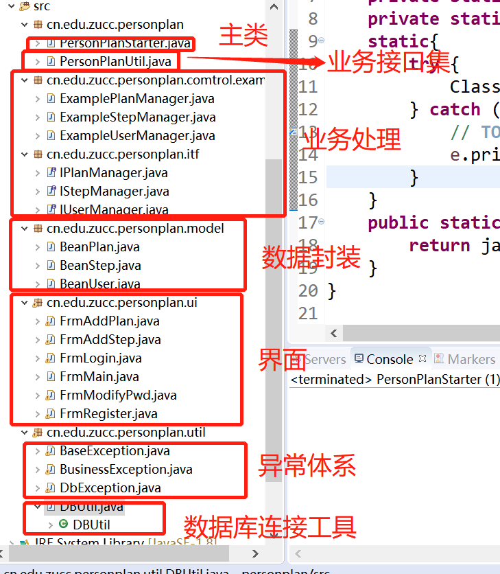
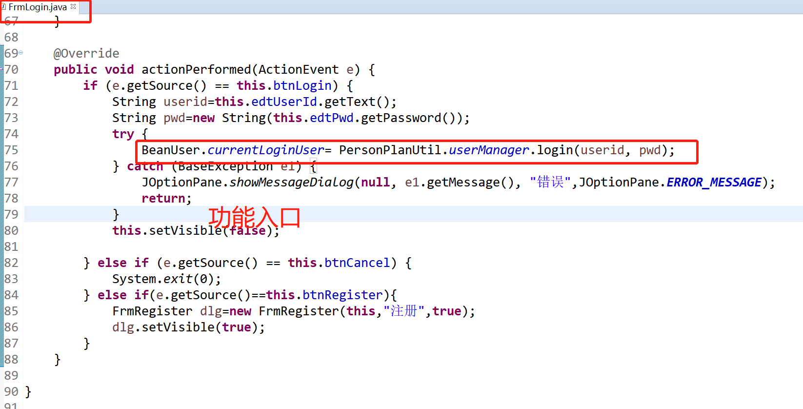
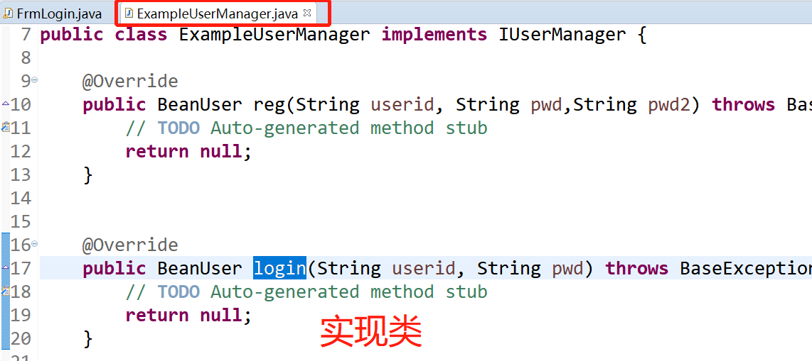

<!-- Slide number: 1 -->
# 个人计划管理

<!-- Slide number: 2 -->

#

<!-- Slide number: 3 -->
# 初始化
建立java工程
导入类库
建立数据库，注意设置编码集
执行脚本
修改Dbutil类

<!-- Slide number: 4 -->
# 功能实现

<!-- Slide number: 5 -->
# 要求（2天）
完成用户注册、用户登陆校验、密码修改功能。
完成计划管理（数据提取、添加、删除功能）和步骤管理模块（数据提取、添加、删除功能）
完成步骤管理模块中（开始、结束、上移、下移）功能开发；完成数据库连接池化改造。
