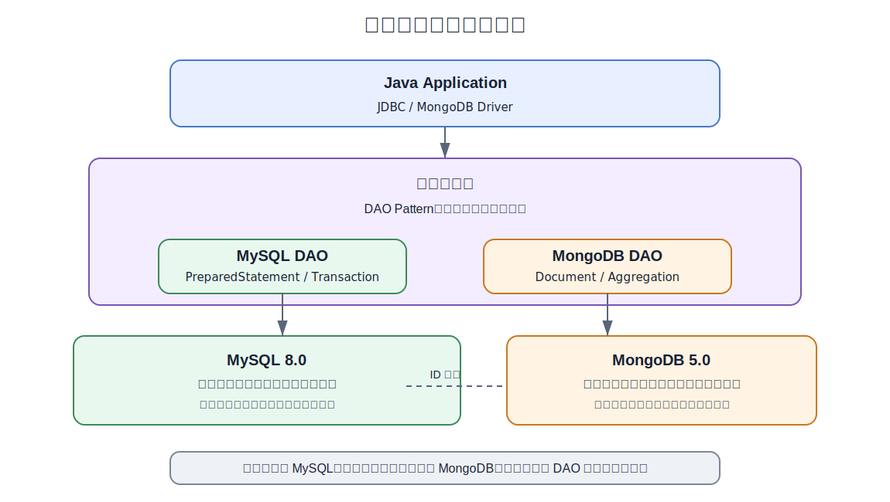

# 数据库系统开发集训项目要求书

- **项目名称**：献血管理系统 - 数据库系统开发
- **项目性质**：单人项目（不分组，每位学生独立完成全部开发任务）
- **集训周期**：15 天（含项目答辩）
- **技术栈**：MySQL 8.0 + MongoDB 5.0 + Java（JDBC）
- **适用对象**：短学期实训 / 数据库课程设计

## 一、项目背景

本实训项目为面向血站的**献血管理系统**，管理献血者、血液库存、用血记录。管理献血者、血液、用血申请。平台需要管理用户、核心业务数据及海量行为日志，系统提供在线操作功能。要求采用 **MySQL + MongoDB 混合数据库架构**，充分发挥关系型与非关系型数据库各自的优势。

### 核心业务场景

| 场景 | 说明 | 数据特征 |
| --- | --- | --- |
| 用户与权限管理 | 注册、登录、角色权限 | 结构化、强一致性 |
| 核心业务管理 | 核心业务数据、分类、状态 | 结构化 + 半结构化 |
| 在线操作 | 浏览、查询、操作 | 高频交互、实时更新 |
| 行为日志 | 操作记录、行为追踪 | 海量、非结构化、高写入 |
| 数据统计 | 统计报表、趋势分析 | 聚合分析、灵活查询 |

## 二、技术架构要求

### 2.1 总体架构



### 2.2 数据库选型原则

| 维度 | MySQL | MongoDB |
| --- | --- | --- |
| **适用场景** | 用户、订单等核心业务 | 行为日志、评论、详情 |
| **数据模型** | 关系模型，严格Schema | 文档模型，灵活Schema |
| **一致性** | ACID事务，强一致性 | 最终一致性，高可用 |
| **查询特征** | 精确查询、联表查询、事务 | 聚合管道、全文检索 |
| **写入模式** | 中等写入，读写均衡 | 高并发写入（日志场景） |

### 2.3 开发环境

| 项目 | 要求 |
| --- | --- |
| JDK | 17 或以上 |
| 构建工具 | Maven 3.8+ |
| MySQL | 8.0+ |
| MongoDB | 5.0+ |
| IDE | IntelliJ IDEA / Eclipse |
| 连接池 | HikariCP（MySQL）、MongoClient（MongoDB） |
| 测试 | JUnit 5 |
| 版本管理 | Git + 码云（Gitee） |

## 三、数据库设计要求

### 3.1 MySQL 数据库设计（关系型核心）

#### 3.1.1 必须包含的表

**模块 1：users（用户表）**

```text
users（用户表）
├── user_id BIGINT PK
├── username VARCHAR(50) UNIQUE
├── password_hash VARCHAR(255)
├── email VARCHAR(100) UNIQUE
├── phone VARCHAR(20)
├── role ENUM('ADMIN','USER')
├── status TINYINT DEFAULT 1
├── created_at DATETIME
├── updated_at DATETIME
```

**模块 2：categories（分类表）**

```text
categories（分类表）
├── category_id BIGINT PK
├── name VARCHAR(50)
├── parent_id BIGINT FK(自引用)
```

**模块 3：items（核心业务表）**

```text
items（核心业务表）
├── item_id BIGINT PK
├── title VARCHAR(200)
├── category_id BIGINT FK
├── status TINYINT DEFAULT 1
├── created_at DATETIME
├── updated_at DATETIME
```

**模块 4：orders（订单/记录表）**

```text
orders（订单/记录表）
├── order_id BIGINT PK
├── user_id BIGINT FK
├── item_id BIGINT FK
├── amount DECIMAL(10,2)
├── status TINYINT DEFAULT 0
├── created_at DATETIME
```

**模块 5：profiles（用户档案表）**

```text
profiles（用户档案表）
├── profile_id BIGINT PK
├── user_id BIGINT FK
├── real_name VARCHAR(50)
├── id_card VARCHAR(20)
├── address VARCHAR(500)
├── notes TEXT
```

#### 3.1.2 MySQL 设计要求清单

| 序号 | 要求 | 说明 |
| --- | --- | --- |
| 1 | 表数量 ≥ 5 张 | 覆盖用户、分类、核心业务、订单、档案 |
| 2 | 主外键约束完整 | 所有 FK 必须显式声明 |
| 3 | 索引设计 | 每个查询频率高的字段建立合适索引 |
| 4 | 视图 ≥ 2 个 | 如”用户详情视图”“业务汇总视图” |
| 5 | 存储过程 ≥ 2 个 | 如”批量更新统计”“月度报表” |
| 6 | 触发器 ≥ 2 个 | 如”订单状态更新触发”“统计自动更新” |
| 7 | 事务处理 | 订单创建等必须使用 JDBC 事务 |
| 8 | 初始数据 | 每表至少准备 10 条测试数据 |

### 3.2 MongoDB 数据库设计（文档型扩展）

#### 3.2.1 必须包含的集合

**集合1：action_logs（行为日志）**

```json
{
 "user_id": "10001",
 "item_id": "2001",
 "action_type": "VIEW",
 "duration_seconds": "120",
 "client_info": { "client_type": "WEB", "ip": "192.168.1.1" },
 "created_at": "ISODate(...)"
}
```

**集合2：comments（评论与互动）**

```json
{
 "user_id": "10001",
 "item_id": "2001",
 "content": "评论内容",
 "rating": "5",
 "tags": [...],
 "created_at": "ISODate(...)"
}
```

**集合3：item_details（业务详情）**

```json
{
 "item_id": "2001",
 "description": "详细描述",
 "images": [...],
 "metadata": { "language": "zh-CN" }
}
```

**集合4：system_logs（系统操作日志）**

```json
{
 "user_id": "10001",
 "log_type": "LOGIN",
 "log_level": "INFO",
 "message": "登录成功",
 "action_detail": { "ip": "192.168.1.1", "operation": "POST /api/login" },
 "timestamp": "ISODate(...)"
}
```

#### 3.2.2 MongoDB 设计要求清单

| 序号 | 要求 | 说明 |
| --- | --- | --- |
| 1 | 集合数量 ≥ 4 个 | 覆盖行为日志、评论、详情、系统日志 |
| 2 | 索引设计 | 为高频查询字段建立索引 |
| 3 | 聚合管道 ≥ 3 个 | 如”用户行为统计”“热门排行”“操作审计” |
| 4 | 嵌套文档设计 | 合理使用嵌套文档和数组 |
| 5 | 初始数据 | 每集合至少准备 20 条测试数据（日志类 100+） |

## 四、功能模块要求

### 4.1 功能清单

| 模块 | 功能项 | 操作数据库 | 说明 |
| --- | --- | --- | --- |
| **用户管理** | 用户注册 | MySQL | 密码加密存储 |
| **用户管理** | 用户登录 | MySQL+MongoDB | 登录日志记录到MongoDB |
| **用户管理** | 信息修改 | MySQL |  |
| **业务管理** | 数据录入 | MySQL+MongoDB | 基础信息MySQL,详情MongoDB |
| **业务管理** | 分类管理 | MySQL | 树形分类 |
| **业务管理** | 数据查询 | MySQL+MongoDB | 多条件分页 |
| **订单管理** | 创建订单 | MySQL | 事务处理 |
| **订单管理** | 订单查询 | MySQL | 按状态/时间筛选 |
| **互动管理** | 发表评论 | MongoDB | 评分+文字 |
| **互动管理** | 评论聚合 | MongoDB | 聚合管道统计 |
| **数据统计** | 热门排行 | MongoDB | 聚合管道 |
| **数据统计** | 用户报告 | MongoDB | 聚合管道 |
| **数据统计** | 月度报表 | MySQL | 存储过程 |

### 4.2 技术实现要求

| 序号 | 要求 | 详情 |
| --- | --- | --- |
| 1 | DAO 模式 | 必须实现 Data Access Object 设计模式 |
| 2 | 连接池 | MySQL 使用 HikariCP 连接池 |
| 3 | 事务管理 | JDBC 手动事务管理（setAutoCommit / commit / rollback） |
| 4 | 批处理 | 日志数据导入使用 JDBC 批处理 |
| 5 | 预编译语句 | 所有SQL必须使用 PreparedStatement 防注入 |
| 6 | MongoDB 聚合 | 使用 Aggregation Pipeline 实现统计功能 |
| 7 | 异常处理 | 统一异常处理，自定义异常类 |
| 8 | 日志输出 | 使用 SLF4J + Logback |
| 9 | 配置管理 | 数据库连接信息使用配置文件（properties/yml） |

## 五、Git 项目管理要求

本项目**必须使用 Git 进行版本管理**，代码托管平台统一使用**码云（Gitee）**，验收时将检查提交日志。

### 5.1 仓库规范

| 要求 | 说明 |
| --- | --- |
| 托管平台 | 码云（https://gitee.com），创建私有或公开仓库 |
| 仓库命名 | `<built-in function dir>` 或自行命名，须与项目名一致 |
| 提交频率 | **每天至少提交一次**，功能节点必须提交 |
| 提交信息 | 必须清晰描述本次提交内容，禁止 update、fix 等无意义信息 |
| 分支策略 | 主分支 main 保持可运行状态 |

### 5.2 提交信息规范

提交信息格式：[Day XX] 功能描述

### 5.3 验收检查项

| 检查项 | 要求 |
| --- | --- |
| 提交次数 | 全程 ≥ 11 次（前11天每天至少1次） |
| 提交信息质量 | 信息清晰，能反映当日开发内容 |
| 代码完整性 | main 分支代码完整可运行 |
| .gitignore | 已正确配置 |
| README.md | 仓库须包含完整 README |

## 六、15天集训日程安排

### 总体阶段划分

- 阶段一（Day 1-3）：需求分析、数据库设计与工程搭建
- 阶段二（Day 4-7）：核心功能开发
- 阶段三（Day 8-11）：优化、测试、文档与答辩准备
- 阶段四（Day 12-15）：项目答辩（4天，单人逐一答辩）

**说明**：开发节奏整体压缩至前11天完成（含测试、文档、PPT），从 Day 12 起进入答辩阶段，共4天。每位学生独立完成全部模块开发，答辩按个人逐一进行。

### 阶段一：需求分析、数据库设计与工程搭建（Day 1-3）

#### Day 1 — 项目启动 & 环境搭建 & 需求分析 & 数据库设计

| 时段 | 内容 | 产出 |
| --- | --- | --- |
| 上午 | 项目宣讲、技术栈介绍、**码云仓库创建**、开发环境搭建 | 环境就绪 + 码云仓库创建并首次提交 |
| 下午 | 需求分析、用例图绘制、MySQL E-R图设计、MongoDB文档模型设计 | 需求规格说明书、E-R图、集合设计文档 |

**交付物**：

- 码云仓库（含初始提交）
- 需求规格说明书（含用例图）
- MySQL E-R图
- MongoDB集合结构设计文档

#### Day 2 — 数据库实现 & 工程搭建 & DAO基础

| 时段 | 内容 | 产出 |
| --- | --- | --- |
| 上午 | 建表SQL编写、视图/存储过程/触发器、MongoDB初始化 | 全部数据库脚本 |
| 下午 | Maven项目创建、依赖配置、工具类、BaseDAO、UserDAO | 项目骨架 + UserDAO完整CRUD |

**交付物**：

- 全部数据库脚本（执行验证通过）
- 项目工程源码（含完整包结构）
- UserDAO + 单元测试
- 码云仓库提交记录（Day 02）

#### Day 3 — 核心业务模块 & MongoDB DAO

| 时段 | 内容 | 产出 |
| --- | --- | --- |
| 上午 | 用户模块（注册/登录/权限）、核心业务模块MySQL部分 | UserService、核心DAO |
| 下午 | MongoDB DAO、详情模块、订单/记录模块 | MongoDB DAO、Service |

**交付物**：

- 用户模块 + 核心业务模块完整代码
- 码云仓库提交记录（Day 03）

### 阶段二：核心功能开发（Day 4-7）

#### Day 4 — 行为日志模块（MongoDB重点）

| 时段 | 内容 | 产出 |
| --- | --- | --- |
| 上午 | 行为日志记录、评论管理 | LogDAO、CommentDAO |
| 下午 | 统计功能（聚合管道） | StatisticsService 初版 |

**交付物**：

- 行为日志模块代码（含聚合管道）
- 码云仓库提交记录（Day 04）

#### Day 5 — 推荐功能 & 跨数据库联查

| 时段 | 内容 | 产出 |
| --- | --- | --- |
| 上午 | 个性化推荐功能实现 | RecommendService |
| 下午 | 跨数据库联查功能实现 | 联合查询服务 + DTO |

**交付物**：

- 推荐模块代码
- 跨数据库联查代码 + DTO
- 码云仓库提交记录（Day 05）

#### Day 6 — 数据统计与报表模块

| 时段 | 内容 | 产出 |
| --- | --- | --- |
| 上午 | MongoDB聚合统计（热门排行、用户报告、操作审计） | 统计服务 |
| 下午 | MySQL存储过程调用（月度报表）、系统操作日志模块 | 存储过程调用 + SystemLogDAO |

**交付物**：

- 统计报表模块完整代码
- 码云仓库提交记录（Day 06）

#### Day 7 — 性能优化、安全加固 & 系统集成

| 时段 | 内容 | 产出 |
| --- | --- | --- |
| 上午 | 索引优化、SQL优化、批处理优化、安全加固 | 优化报告 + 安全检查清单 |
| 下午 | 全模块功能联调、端到端测试、Bug修复 | 系统稳定版 |

**交付物**：

- 性能优化报告
- 安全检查清单
- 系统稳定版代码
- 码云仓库提交记录（Day 07）

### 阶段三：优化、测试、文档与答辩准备（Day 8-11）

#### Day 8 — 单元测试补充 & 压力测试 & 代码重构

| 时段 | 内容 | 产出 |
| --- | --- | --- |
| 上午 | 补充单元测试（JUnit 5）、事务回滚测试 | 单元测试完整代码 |
| 下午 | 压力测试（批量10000条日志+50并发）、代码重构 | 压力测试报告 + 重构后代码 |

**交付物**：

- 完整单元测试代码
- 压力测试报告
- 码云仓库提交记录（Day 08）

#### Day 9 — 技术文档 & 用户手册

| 时段 | 内容 | 产出 |
| --- | --- | --- |
| 上午 | 技术设计文档编写 | 技术设计文档 |
| 下午 | 用户手册编写 | 用户手册 |

**交付物**：

- 技术设计文档
- 用户手册
- 码云仓库提交记录（Day 09）

#### Day 10 — 答辩PPT制作 & 文档终稿

| 时段 | 内容 | 产出 |
| --- | --- | --- |
| 上午 | 答辩PPT制作 | 答辩PPT |
| 下午 | 全部文档终稿确认、README.md 完善 | 全部文档终稿 |

**交付物**：

- 项目答辩.pptx
- 全部文档终稿
- 码云仓库提交记录（Day 10）

#### Day 11 — 答辩预演 & 代码审查准备

| 时段 | 内容 | 产出 |
| --- | --- | --- |
| 上午 | 答辩全流程预演（限时15分钟/人） | 预演记录 |
| 下午 | 代码审查自检、码云提交记录整理、最终Bug修复 | 代码审查自检清单 |

**交付物**：

- 预演记录（含改进点）
- 代码审查自检清单
- 码云仓库最终提交记录

### 阶段四：项目答辩（Day 12-15）

从 Day 12 起进入答辩阶段，共4天。每位学生逐一答辩，前两天为个人项目答辩，后两天为代码审查、评审答疑与成绩公布。

#### Day 12 — 项目答辩（第一批）

| 时段 | 内容 | 说明 |
| --- | --- | --- |
| 08:30-09:00 | 答辩准备工作 | 环境检查、系统启动确认 |
| 09:00-12:00 | **上午场答辩** | 每人15分钟：PPT 10分钟 + 系统演示 5分钟 |
| 14:00-17:00 | **下午场答辩** | 每人15分钟：PPT 10分钟 + 系统演示 5分钟 |
| 17:00-18:00 | 当日答辩小结 | 评委记录问题，次日复用 |

#### Day 13 — 项目答辩（第二批）

| 时段 | 内容 | 说明 |
| --- | --- | --- |
| 09:00-12:00 | **上午场答辩** | 每人15分钟：PPT 10分钟 + 系统演示 5分钟 |
| 14:00-17:00 | **下午场答辩** | 每人15分钟：PPT 10分钟 + 系统演示 5分钟 |
| 17:00-18:00 | 当日答辩小结 | 评委记录问题，次日复用 |

#### Day 14 — 代码审查 & 评审答疑

| 时段 | 内容 | 说明 |
| --- | --- | --- |
| 上午 | 代码审查（逐人进行） | 评委现场查看码云仓库，检查代码规范、DAO模式、事务处理、聚合管道实现 |
| 下午 | 技术问答（逐人进行） | 评委针对代码和设计提问：事务、索引、聚合、JDBC、混合架构等 |

#### Day 15 — 成绩汇总 & 项目总结

| 时段 | 内容 | 说明 |
| --- | --- | --- |
| 上午 | 评委闭门评审、成绩汇总 | 综合答辩、代码审查、技术问答、Git提交记录评分 |
| 下午 | 成绩公布、项目总结交流 | 公布成绩、优秀项目展示、实训总结 |

**答辩评审标准**（适用于 Day 12-15 全程）：

| 评审项 | 要求 | 分值 |
| --- | --- | --- |
| PPT汇报 | 结构清晰、重点突出、10分钟以内 | 15分 |
| 系统演示 | 现场运行稳定，核心功能完整展示 | 25分 |
| 代码审查 | 代码规范、DAO模式正确、事务与聚合查询实现正确 | 20分 |
| 数据库设计 | MySQL表设计合理、MongoDB文档模型合理、索引设计正确 | 20分 |
| Git提交记录 | 提交次数≥11次、提交信息清晰、码云仓库完整 | 10分 |
| 技术问答 | 评委提问（事务、索引、聚合、JDBC、混合架构等） | 10分 |
| **合计** |  | **100分** |

**答辩检查清单**（每人必查）：

- [ ] 码云仓库可正常访问
- [ ] 提交记录 ≥ 11 次，信息清晰
- [ ] 系统可现场运行演示
- [ ] PPT文件可正常打开
- [ ] 技术文档、用户手册已提交

## 七、项目目录结构

```text
blood-donation/
├── pom.xml
├── src/
│   ├── main/
│   │   ├── java/com/blooddonation/
│   │   │   ├── Main.java
│   │   │   ├── config/
│   │   │   │   └── DBConfig.java
│   │   │   ├── util/
│   │   │   │   ├── MySQLDBUtil.java
│   │   │   │   ├── MongoDBUtil.java
│   │   │   │   └── PasswordUtil.java
│   │   │   ├── dao/
│   │   │   │   ├── BaseDAO.java
│   │   │   │   ├── MongoBaseDAO.java
│   │   │   │   ├── mysql/
│   │   │   │   │   ├── UserDAO.java
│   │   │   │   │   ├── CategoryDAO.java
│   │   │   │   │   ├── ItemDAO.java
│   │   │   │   │   ├── OrderDAO.java
│   │   │   │   │   └── ProfileDAO.java
│   │   │   │   └── mongo/
│   │   │   │       ├── LogDAO.java
│   │   │   │       ├── CommentDAO.java
│   │   │   │       ├── DetailDAO.java
│   │   │   │       └── SystemLogDAO.java
│   │   │   ├── service/
│   │   │   │   ├── UserService.java
│   │   │   │   ├── BusinessService.java
│   │   │   │   ├── StatisticsService.java
│   │   │   │   └── RecommendService.java
│   │   │   ├── dto/
│   │   │   │   └── ReportDTO.java
│   │   │   └── exception/
│   │   │       ├── BusinessException.java
│   │   │       └── DBException.java
│   │   └── resources/
│   │       ├── db.properties
│   │       ├── logback.xml
│   │       └── sql/
│   │           ├── mysql_schema.sql
│   │           ├── mysql_views.sql
│   │           ├── mysql_procedures.sql
│   │           ├── mysql_triggers.sql
│   │           ├── mysql_init_data.sql
│   │           └── mongodb_init.js
│   └── test/
│       └── java/com/blooddonation/
│           ├── dao/
│           │   ├── UserDAOTest.java
│           │   └── ItemDAOTest.java
│           └── service/
│               └── StatisticsServiceTest.java
├── docs/
│   ├── 技术设计文档.pdf
│   ├── 用户手册.pdf
│   └── 项目答辩.pptx
└── README.md
```

## 八、Maven 依赖参考

```xml
<dependencies>
  <!-- MySQL JDBC Driver -->
  <dependency>
    <groupId>com.mysql</groupId>
    <artifactId>mysql-connector-j</artifactId>
    <version>8.3.0</version>
  </dependency>

  <!-- MongoDB Java Driver -->
  <dependency>
    <groupId>org.mongodb</groupId>
    <artifactId>mongodb-driver-sync</artifactId>
    <version>4.11.1</version>
  </dependency>

  <!-- HikariCP 连接池 -->
  <dependency>
    <groupId>com.zaxxer</groupId>
    <artifactId>HikariCP</artifactId>
    <version>5.1.0</version>
  </dependency>

  <!-- BCrypt 密码加密 -->
  <dependency>
    <groupId>org.mindrot</groupId>
    <artifactId>jbcrypt</artifactId>
    <version>0.4</version>
  </dependency>

  <!-- SLF4J + Logback -->
  <dependency>
    <groupId>org.slf4j</groupId>
    <artifactId>slf4j-api</artifactId>
    <version>2.0.9</version>
  </dependency>
  <dependency>
    <groupId>ch.qos.logback</groupId>
    <artifactId>logback-classic</artifactId>
    <version>1.4.14</version>
  </dependency>

  <!-- JUnit 5 -->
  <dependency>
    <groupId>org.junit.jupiter</groupId>
    <artifactId>junit-jupiter</artifactId>
    <version>5.10.1</version>
    <scope>test</scope>
  </dependency>
</dependencies>
```

## 九、评分标准

| 评分维度 | 分值 | 评分细则 |
| --- | --- | --- |
| **数据库设计** | 20分 | MySQL表设计合理(8) + MongoDB文档模型合理(6) + 索引设计(6) |
| **功能完整性** | 25分 | MySQL CRUD(8) + MongoDB CRUD(7) + 事务处理(5) + 聚合查询(5) |
| **代码质量** | 20分 | DAO模式(6) + 编码规范(5) + 异常处理(4) + 单元测试(5) |
| **Git提交记录** | 10分 | 提交次数≥11次(5) + 提交信息清晰(3) + 码云仓库完整(2) |
| **技术深度** | 10分 | 视图/存储过程/触发器(3) + 跨数据库联查(4) + 性能优化(3) |
| **文档与答辩** | 15分 | 技术文档(5) + 用户手册(3) + 系统演示(4) + PPT汇报(3) |
| **合计** | **100分** |  |

### 加分项（最高+10分）

| 加分项 | 分值 |
| --- | --- |
| 使用连接池监控面板展示 | +2 |
| 实现读写分离思路 | +3 |
| 实现简单的数据库连接故障自动重连 | +2 |
| 完善的日志系统（操作审计日志） | +3 |

## 十、交付物清单

| 序号 | 交付物 | 格式 | 提交时间 |
| --- | --- | --- | --- |
| 1 | 码云仓库地址 | Git仓库 | Day 1 |
| 2 | 需求规格说明书 | PDF | Day 1 |
| 3 | MySQL E-R图 | PDF/图片 | Day 2 |
| 4 | MongoDB集合设计文档 | PDF | Day 2 |
| 5 | MySQL DDL脚本 | .sql | Day 3 |
| 6 | MongoDB初始化脚本 | .js | Day 3 |
| 7 | 项目源码 | Git仓库 | Day 1-11 |
| 8 | 性能优化报告 | PDF | Day 7 |
| 9 | 测试报告 | PDF | Day 8 |
| 10 | 技术设计文档 | PDF | Day 9 |
| 11 | 用户手册 | PDF | Day 9 |
| 12 | 答辩PPT | PPTX | Day 10 |
| 13 | 项目总结报告 | PDF | Day 15 |

## 十一、注意事项

1. **所有SQL必须使用 PreparedStatement**，严禁字符串拼接SQL。
2. **事务操作必须显式管理**（setAutoCommit(false) → commit() / rollback()）。
3. **密码严禁明文存储**，必须使用 BCrypt 或类似算法加密。
4. **MongoDB 文档设计**应充分体现文档模型优势，避免简单模仿关系表结构。
5. **跨数据库联查**时注意数据一致性，MySQL中的ID作为MongoDB文档的引用字段。
6. **Git提交**要求使用码云，每天至少提交一次，提交信息清晰，验收时必查。
7. **每日提交**当天交付物，由指导老师检查后方可进入下一阶段。
8. **严禁抄袭**，发现代码雷同者双方均按0分处理。

本项目要求书最终解释权归指导教师团队所有。

文档版本：v1.0 | 发布日期：2026-07-05
